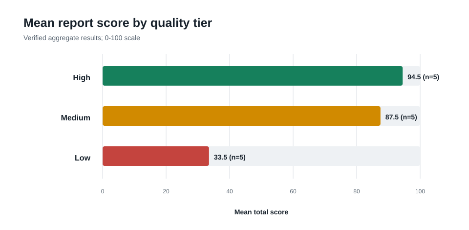
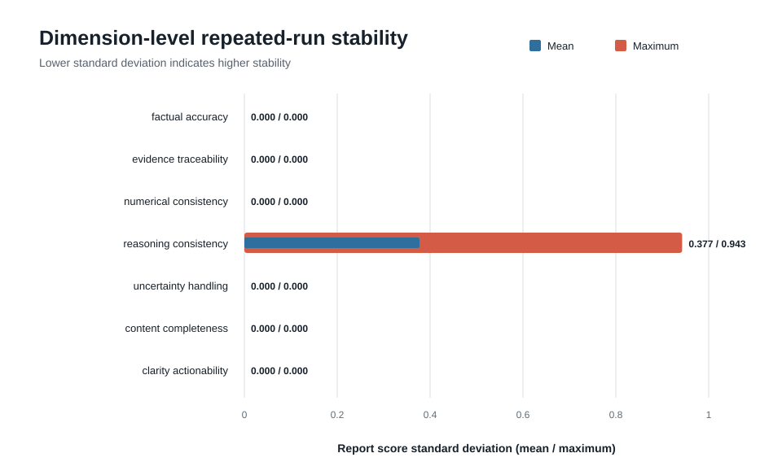

# P1 技术迁移泛化实验报告

## 1. 实验目的

本实验检查 ReproEval 在五类技术迁移场景中能否区分仓库构造的高、中、低三档报告，并观察同一冻结数据集上三次独立 Hy3 Judge 运行的波动。实验回答的是“当前评估流程能否稳定识别这组合成质量差异”，不回答方案是否能够真实部署，也不以合成标签替代专家真值。

## 2. 实验设置

| 项目 | 设置 |
| --- | --- |
| 执行时间 | 2026-09-02 |
| 模型 | `hy3` |
| API 渠道 | 腾讯云 TokenHub |
| 数据集 | `reproeval-p1-synthetic-transfer` `0.1.0` |
| 来源组 | 5 组，相互隔离 |
| 报告 | 15 份，每组包含高、中、低三档 |
| 数据划分 | development 1 组、validation 2 组、test 2 组 |
| 独立运行 | 3 次 |
| Hy3 Judge 调用 | 45 次，全部成功 |
| Rubric | 7 个维度，版本 `0.1.0` |

Dataset Freeze SHA-256 为 `91B7DA90654FBFFD15C51F6197A74F782825F8DB55164E684B63EB0782CA2685`。三次运行使用不同 `run_id` 和 Judge Record Index，并在离线 replay 后汇总；原始请求与响应保留在本地忽略目录，不进入公开结果包。

## 3. 主要结果

| 指标 | Run 1 | Run 2 | Run 3 |
| --- | ---: | ---: | ---: |
| 组内两两排序准确率 | 100% | 100% | 100% |
| 完整高 > 中 > 低顺序准确率 | 100% | 100% | 100% |
| 组内宏平均 Spearman | 1.0 | 1.0 | 1.0 |
| 已登记错误召回率 | 100% | 100% | 100% |
| 未登记错误数 | 3 | 4 | 4 |

validation 和 test 分别包含 2 个来源组、6 份报告；三次运行中两类划分均保持完整排序正确。全部 15 份报告都获得有效总分，没有 provisional、状态翻转或排序资格翻转。

按三次运行的报告均值汇总：

| 构造档位 | 平均总分 |
| --- | ---: |
| 高 | 94.5 |
| 中 | 87.5 |
| 低 | 33.5 |

高、中、低三档在连续分数上保持严格顺序，但高档和中档都落入 `excellent` 质量带。这说明当前连续分数具有判别力，而离散质量带对高、中档的区分仍然偏粗。

### 3.1 聚合结果图





两张 SVG 仅由已验签的聚合 CSV 确定性生成。其 Figure Manifest 绑定源结果包 manifest 的 SHA-256；图表用于辅助阅读，不构成额外实验样本或新结论。

## 4. 稳定性

- 15/15 份报告在三次运行中均完整评分；
- 报告总分标准差均值为 `1.414214`，最大值为 `3.535534`，满足预登记的 `<= 5` 工程目标；
- 质量带翻转、排序资格翻转和评估状态翻转均为 0；
- 七个维度中仅 `reasoning_consistency` 出现非零波动，逐报告维度标准差最大值为 `0.942809`；
- 其余六个维度由确定性证据校验或稳定结构约束主导，三次运行的逐报告维度分数未发生变化。

该结果表明当前混合架构把模型波动集中在语义推理维度，没有让 Hy3 输出覆盖本地数值、引用和结构判断。

## 5. 典型差异与失败模式

### 5.1 高质量报告仍被标记 reasoning gap

三次运行分别产生 3、4、4 个未登记错误，全部是高档报告上的 `reasoning_gap`。五份高档报告在 15 次“报告 × 运行”观察中有 11 次出现该标记。不同运行对具体报告的判断并不完全一致，这也是总分波动仅集中在 `reasoning_consistency` 的原因。

这些错误只能称为“相对合成登记标签的未登记错误”，不能在没有人工复核时称为误报。它提示两种可能：高档参考报告的论证链仍不够完整，或当前 Judge 对推理闭合的阈值偏严。后续应由盲化专家标注区分这两种解释。

### 5.2 中档报告得分偏高

五份中档报告的三次均值都为 87.5，并与高档报告同属 `excellent`。当前数据构造主要删除推理和行动建议，其他确定性维度仍保持高分，因此加权总分没有把中档压到更低质量带。后续可增加“条件遗漏但表述完整”“术语堆砌但证据不足”等更难的中档变异，并依据人工标签重新校准质量带阈值。

### 5.3 P1 未覆盖对抗攻击

本数据集聚焦跨背景迁移，没有登记 adversarial report，因此对抗检测率、攻击误接受率等指标为 `null`。P0 中的对抗协议测试不能直接外推到技术迁移场景。

## 6. 结论边界

本实验支持以下有限结论：在五组合成迁移材料和当前 Rubric 上，三次真实 Hy3 Judge 运行均正确保持高、中、低的组内顺序，已登记错误全部被识别，且总分波动满足预登记工程阈值。

本实验不支持以下结论：

- 不证明合成技术方案在目标环境中可部署；
- 不证明质量档位或错误标签是专家真值；
- 不证明对未见真实论文、专利或代码仓库的泛化能力；
- 不证明 Hy3 与领域专家具有一致判断；
- 不提供法律意见、学术不端判断或目标性能点预测。

下一步应使用仓库提供的盲审工作包，由至少两名具备科研阅读经验的标注者独立评估 validation/test 报告，再计算人工一致性、系统-人工 Spearman 和 MAE，并对 `reasoning_gap` 分歧进行独立裁决。

## 7. 可复核工件

公开结果位于 [`results/p1_transfer_judge`](../results/p1_transfer_judge)，包含运行级、报告级和维度级 CSV、Markdown 摘要以及 SHA-256 manifest。可执行：

```bash
hy3-reproeval verify-results-export --bundle results/p1_transfer_judge
hy3-reproeval verify-results-figures \
  --figures results/p1_transfer_judge_figures \
  --source-bundle results/p1_transfer_judge
```

公开结果不包含 API Key 或原始 Hy3 响应；manifest 保留 Dataset、Freeze、Rubric、Benchmark 和 Judge Record Index 的指纹，用于确认公开汇总对应同一条冻结实验血缘。
