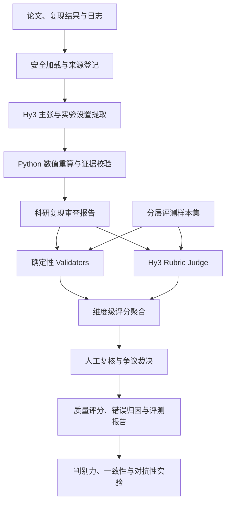

# Hy3 ReproEval 项目方案

> 方案名称：面向科研复现审查与技术迁移报告的多工具生成及可信评测系统  
> GitHub：待补充

## 1. 项目概述

### 1.1 项目背景

大语言模型已经能够辅助完成论文阅读、实验结果分析、技术调研和结构化报告生成，但此类任务通常不存在唯一标准答案。报告语言流畅或结构完整，并不代表其中的事实、数值、引用和结论可靠。当前常见的通用 LLM 评分方法还容易受到篇幅、表达风格、专业术语堆砌和伪造引用的干扰，难以直接用于科研审查等证据要求较高的场景。

本人在前期腾讯犀牛鸟实战 Issue “Build an MCP Server powered by Hy3”中完成了 Hy3 ReproScope MCP Server，并提交 [Hy3 PR #187](https://github.com/Tencent-Hunyuan/Hy3/pull/187)。现有系统提供 10 个 MCP Tool，覆盖论文复现审查、技术方案迁移评估、证据图构建、结构化报告生成和只读仓库审计，并完成 CodeBuddy、Visual Studio Code 客户端验证、自动化测试及跨 Python 版本 CI。

本次实战将在上述工程基础上进一步研究一个更核心的问题：**如何对 Hy3 多工具工作流生成的开放式科研报告进行可操作、可复核且经过实验验证的质量评估。**

### 1.2 项目目标

本项目计划构建 Hy3 ReproEval，将开放式科研报告生成和报告质量评估组成一条完整闭环：

1. 使用 Hy3 和本地工具生成论文复现审查报告；
2. 使用确定性规则、Hy3 Rubric Judge 和人工标注共同评估报告质量；
3. 对评分结果给出维度级证据、错误类型和改进建议；
4. 通过好、中、差分档样本、人工一致性实验和对抗样本验证评估器是否有效；
5. 将现有技术迁移评估工作流作为跨场景泛化实验，验证评估框架的可扩展性。

## 2. 总体设计思路

项目采用“**Hy3 语义判断 + Python 确定性验证 + 人工复核校准**”的混合评估方案。

- Hy3 负责理解论文、识别主张、分析证据关系、判断报告推理是否合理；
- Python 负责文件安全读取、数值重算、引用定位、Schema 校验、工件血缘和固定量表聚合；
- 人工标注用于验证评估器与研究人员判断的一致程度，并处理存在争议的开放式结论；
- 最终评分必须附带可检查的证据和错误归因，避免只输出一个缺少解释的总分。

项目区分两个相互独立的对象：

1. **应用生成器**：根据论文、复现结果和实验日志生成科研审查报告；
2. **质量评估器**：评价报告是否事实正确、证据充分、推理成立并正确表达不确定性。

评估器本身是本次实战的主要新增贡献，现有 ReproScope 主要作为应用生成器和工程基础使用。

## 3. 系统架构

### 3.1 分层模块

| 层级 | 主要职责 | 计划实现 |
| --- | --- | --- |
| 输入层 | 文件解析、允许目录、来源、隐私边界 | PDF/Markdown/TXT、CSV/JSON/JSONL、LOG |
| 应用层 | 生成论文复现审查和技术迁移报告 | Hy3 语义提取、本地统计、证据图、Markdown 报告 |
| 验证层 | 检查可确定判断的内容 | 引用存在性、定位有效性、数值反算、单位、Schema、血缘 |
| Judge 层 | 判断开放式语义质量 | Hy3 结构化 Rubric Judge、重复评测、错误分类 |
| 聚合层 | 汇总评分并应用硬性约束 | 固定权重、覆盖率、拒答门槛、关键错误上限 |
| 人工层 | 提供独立参照 | 双人盲评、分歧记录、裁决标签 |
| 接入层 | 面向用户调用 | Python CLI、MCP Server，条件允许时补充 Skill 适配 |
| 评测层 | 验证评估方法有效性 | 分档排序、一致性、稳定性、对抗性和失败模式分析 |

### 3.2 计划提供的高层工具

| Tool | 功能 | 核心实现 |
| --- | --- | --- |
| `generate_reproduction_report` | 生成论文复现审查报告 | Hy3 + 本地统计与证据校验 |
| `generate_transfer_report` | 生成技术方案迁移报告 | Hy3 + 条件化规则 |
| `evaluate_report` | 对单份报告进行七维评估 | Validators + Hy3 Judge |
| `compare_report_quality` | 对多份报告进行盲化比较与排序 | 成对比较 + 固定聚合 |
| `explain_evaluation` | 输出扣分证据、错误类别和改进建议 | 本地结果解释 |

批量 Benchmark 通过 CLI 和 Python API 执行，避免在 MCP 会话中运行长耗时任务。

## 4. 重点技术方案

### 4.1 结构化 Hy3 推理

所有 Hy3 调用要求输出版本化 JSON，并使用 Pydantic 进行 Schema 校验。对于代码围栏、尾随文本或可恢复 JSON 错误，系统进行有界修复；无法可靠修复时显式失败，不把非结构化文本直接写入评测结果。

每次调用记录模型名称、接口提供方、Prompt 版本、时间和响应哈希，支持离线响应回放。API Key 仅通过环境变量传入，不写入仓库或结果文件。

### 4.2 语义判断与确定性计算分离

Hy3 不直接决定可重新计算的数值。样本数、均值、标准差、差值、相对差异和量表加权结果均由 Python 计算；Hy3 仅提供指标语义映射、证据关系和维度级解释。模型输出与本地验证冲突时，以本地结果为准并生成 warning。

### 4.3 可追溯工件和证据闭合

每个输入来源记录 source ID、局部定位和 SHA-256；每个中间工件记录 run ID、Schema 版本、父工件和 payload hash。后续步骤在组合工件前验证版本、路径、内容哈希和直接父级，防止把不同论文、不同实验或不同运行的结果混合使用。

### 4.4 混合质量评估器

质量评估由三类信号共同组成：

- **确定性信号**：引用是否存在、统计量是否正确、字段是否完整、工件是否被修改；
- **Hy3 Judge 信号**：事实与结论关系、推理一致性、报告完整性和建议可操作性；
- **人工信号**：独立标注者评分、证据定位和争议裁决。

确定性错误不能被语言质量抵消。出现伪造引用、关键数值错误、来源血缘不一致或无证据强结论时，系统应用硬性降级或总分上限。

### 4.5 MCP 与 Skill 复用

核心业务逻辑保持与传输协议解耦，通过 Python API 暴露，再分别由 CLI、MCP Tool 和 Skill 调用。MCP 负责跨客户端即插即用；Skill 负责描述工具使用顺序、输入要求、失败恢复和结果解释。即使 Skill 未在首个版本完成，也不影响核心应用和评估实验运行。

## 5. 评判标准设计

项目采用七维公共 Rubric，每项按 0～4 分评价。完整锚点、判断条件和正反例将存放于版本化 `rubric.yaml`，下表给出核心判定依据。

| 维度 | 权重 | 0 分锚点 | 2 分锚点 | 4 分锚点 |
| --- | ---: | --- | --- | --- |
| 事实准确性 | 20% | 多项关键事实与来源冲突 | 主要事实正确但有局部错误 | 关键事实均由当前材料支持 |
| 证据可追溯性 | 18% | 关键引用伪造或不可定位 | 部分结论有来源但覆盖不全 | 关键结论均有有效来源定位 |
| 数值一致性 | 15% | 关键数值或单位错误 | 主要计算正确但存在小偏差 | 数值、单位和统计量均可复算 |
| 推理一致性 | 15% | 证据无法支持结论或相互矛盾 | 推理基本成立但存在跳步 | 证据、分析与结论完整闭合 |
| 不确定性处理 | 12% | 证据不足仍输出强结论 | 能提示部分缺口但置信度不稳 | 正确拒答、降级并列出证据缺口 |
| 内容完整性 | 10% | 缺少多数任务关键项 | 覆盖主要内容但遗漏局部设置 | 完整覆盖主张、设置、结果和限制 |
| 可理解性与可操作性 | 10% | 报告难以理解且无可执行建议 | 结构基本清楚、建议较笼统 | 表达清晰并给出可验证的后续步骤 |

1 分和 3 分表示相邻锚点之间的中间状态。维度缺少足够证据时使用 `insufficient_evidence`，不直接按 0 分处理；可评估权重低于 50% 时不输出总体质量等级。

### 5.1 场景扩展项

论文复现审查额外检查实验设置透明度、基线公平性、消融质量和统计报告充分性。技术迁移报告额外检查假设兼容性、依赖可行性、资源约束、改造风险和验证准备度。扩展项首先用于错误归因，不在缺少校准实验时随意改变公共 Rubric 权重。

### 5.2 错误分类体系

计划建立以下错误标签：`unsupported_claim`、`fabricated_citation`、`citation_mismatch`、`numeric_error`、`unit_error`、`setting_omission`、`reasoning_gap`、`overconfidence`、`missing_limitation`、`verbosity_without_evidence`、`format_violation`和`artifact_lineage_error`。

## 6. 评测样本集设计

### 6.1 样本规模

首版计划构建 20 组输入材料，每组制作高、中、低三档报告，共 60 份待评估输出：

- 15 组论文复现材料，共 45 份报告，作为主评测场景；
- 5 组技术迁移材料，共 15 份报告，作为跨场景泛化验证；
- 至少 12 份难例或反例；
- 至少 8 份包含对抗性设计的报告。

若时间或人工标注资源不足，P0 最低交付为 12 组论文材料、36 份分档报告和完整有效性实验；技术迁移泛化集属于 P1 增强项，不影响任务一主闭环成立。

### 6.2 数据来源

优先采用本人构造的合成论文、实验结果和日志，以及许可明确的开放获取论文材料。每组材料记录来源、构造方法、许可证、获取日期、内容哈希和可公开范围。私有论文、未公开实验数据及任何包含个人敏感信息的材料不进入公开仓库。

### 6.3 质量档位构造

- 高质量报告：由 Hy3 生成后经过规则校验和人工修订，作为“参考质量输出”，不称为唯一标准答案；
- 中等质量报告：受控删除部分引用、实验条件、限制说明或验证步骤；
- 低质量报告：注入错误数值、无依据结论、伪造引用、错误单位或血缘不一致；
- 对抗报告：通过增加篇幅、堆砌术语、重复结论、伪造权威引用等方式尝试骗取高分。

所有退化操作记录到 `mutation_manifest.json`，明确预期受影响维度和错误标签，使判别力验证具有可重复的参照。

### 6.4 数据划分与防泄漏

按照原始输入组进行开发集、验证集和测试集划分，建议为 12/4/4 组。来自同一论文或方案的三个质量变体必须位于同一集合，避免同源信息泄漏。测试集在 Rubric、阈值和 Prompt 定稿前保持冻结。

## 7. 评估方法有效性验证

### 7.1 判别力验证

对每组高、中、低三档报告进行盲化排序，计算三档完全排序准确率、成对排序准确率、Spearman 相关系数和各维度分数间隔。重点分析评估器无法区分相邻档位的案例。

### 7.2 人工一致性验证

邀请至少两名具有科研阅读经验的标注者对验证集和测试集进行独立盲评。标注者逐维给分、选择错误类型并引用证据位置；维度分差超过 1 分时进入裁决。报告加权 Cohen's Kappa 或 ICC，并计算自动评分与人工评分的 Spearman 相关系数和平均绝对误差。

如果最终只能获得一名外部标注者，则保留该限制，并使用间隔一段时间后的重复标注估计自身稳定性，不把它表述为多人一致性结果。

### 7.3 重复评测稳定性

在固定 Prompt、模型和输入下对测试样本重复评估 3 次，报告总分标准差、维度级波动和质量等级翻转率。原始响应经脱敏后保存哈希，支持结果复查和离线回放。

### 7.4 对抗性验证

评估器需要识别篇幅膨胀、术语堆砌、伪造引用、错误计算、隐去限制和无依据高置信度结论。报告每类攻击的识别率、错误放行率及典型失败案例，不仅展示成功样本。

### 7.5 目标指标

以下为计划目标，不在实验完成前写成已达到结果：

| 指标 | 目标值 |
| --- | ---: |
| 高/中/低完全排序准确率 | ≥ 85% |
| 自动评分与人工评分 Spearman 相关系数 | ≥ 0.70 |
| 人工标注一致性 Kappa 或 ICC | ≥ 0.60 |
| 重复评测总体分数标准差 | ≤ 5/100 |
| 对抗样本识别率 | ≥ 80% |
| 伪造引用和关键数值错误拦截率 | 100%（确定性可检查部分） |

目标未达到时仍完整披露结果，分析原因并调整 Rubric、Prompt、硬性规则或适用边界，不删除低分案例。

## 8. 工程实现与质量保障

### 8.1 技术栈

- Python 3.11 及以上；
- Hy3 API，使用 OpenAI-compatible 接口；
- MCP Python SDK；
- Pydantic、HTTPX、PyYAML；
- pytest、Ruff、GitHub Actions；
- Markdown、JSON、JSONL、CSV 作为主要可审计工件格式。

### 8.2 测试策略

- 单元测试：量表聚合、数值重算、引用验证、Schema 和错误分类；
- 回放测试：固定 Hy3 响应，验证完整工作流不变量；
- 集成测试：真实 Hy3 最小调用、CLI、MCP Tool 和报告生成；
- 数据测试：分组隔离、标签完整性、难例比例和来源清单；
- 安全测试：路径越界、Prompt Injection 文本、密钥泄漏和工件篡改；
- 分发测试：构建 wheel、隔离安装、模块入口和包内容检查。

CI 计划覆盖 Linux Python 3.11、3.12、3.13，并在资源允许时增加 Windows 3.11。真实在线 API 评测不在不可信 PR 上自动执行，使用手动授权或离线回放避免密钥泄漏。

### 8.3 可复现性

仓库提供 `.env.example`、固定依赖、样本 Manifest、Rubric 版本、Prompt 版本、随机种子、评测命令和机器可读结果。公开结果必须能够在无 API Key 时通过响应回放复核聚合过程，在有 Hy3 API Key 时重新运行完整评测。

## 9. 预期产出

| 任务书要求 | 计划产出 |
| --- | --- |
| 开源项目仓库 | 应用源码、CLI、MCP/Skill 适配、README、环境示例、许可证 |
| 可运行 AI 应用 | 论文复现审查报告生成；技术迁移作为泛化场景 |
| 评估方法 | 七维 Rubric、确定性 Validators、Hy3 Judge、人工复核协议 |
| 评测样本集 | 20 组输入、60 份分档报告、难例、反例和对抗样本 |
| 评测脚本 | 单份评估、批量评测、排序、一致性和对抗性分析脚本 |
| 完整结果 | CSV/JSON 结果表、图表、典型 Case 和错误类型分布 |
| 有效性验证 | 判别力、人工一致性、重复稳定性和对抗性实验 |
| 分析报告 | 场景理由、架构、Rubric 依据、失败模式和能力边界 |
| 演示材料 | 2 分钟以内视频或 GIF，展示生成、评估和错误归因闭环 |

## 10. 预期效果与创新点

1. 将原有“生成科研审查报告”的应用升级为“生成、验证、评价和人工校准”的完整闭环；
2. 以证据追溯、数值重算和工件血缘约束 LLM Judge，降低只凭语言风格评分的问题；
3. 对开放式报告建立可操作的 0～4 分锚点和错误分类体系，提高不同评审者之间的可复核性；
4. 通过受控质量退化获得明确的相对质量标签，验证评估器是否真的具有判别力；
5. 通过对抗样本研究评估器对伪造引用、术语堆砌和无依据结论的抵抗能力；
6. 使用主场景与泛化场景验证同一评估核心能否支持不同多工具 Hy3 应用。

预期最终形成一个可复用的 Hy3 开放式产物评估模板。开发者可以替换业务 Workflow 和场景扩展 Rubric，同时复用来源登记、确定性校验、Judge、人工标注、评测实验和结果分析框架。

## 11. 时间规划

项目终稿提交时间为 2026 年 9 月 11 日，采用 P0 主闭环优先、P1 泛化增强后置的倒排计划。

| 日期 | 阶段 | 主要工作 | 验收节点 |
| --- | --- | --- | --- |
| 8 月 26 日～8 月 27 日 | 方案与仓库初始化 | 确定边界、新建个人公开仓库、数据模型、Rubric v0.1、CI 骨架 | README 骨架、Schema 与最小测试通过 |
| 8 月 28 日～8 月 31 日 | P0 应用链迁移 | 抽取 ReproScope 通用模块，跑通论文材料到审查报告 | CLI 和 MCP 完成一个端到端案例 |
| 9 月 1 日～9 月 3 日 | P0 评估器 | 实现七维 Rubric、Validators、Hy3 Judge、错误归因和聚合 | 单份报告评估可重复运行 |
| 9 月 4 日～9 月 6 日 | 数据集与对抗样本 | 完成分档输出、Mutation Manifest、数据划分和防泄漏检查 | 至少 36 份 P0 报告；争取达到 60 份 |
| 9 月 7 日～9 月 8 日 | 有效性实验 | 人工盲评、判别力、一致性、稳定性和对抗性实验 | 生成完整 CSV/JSON 结果和初步图表 |
| 9 月 9 日 | P1 泛化与分析 | 完成技术迁移小规模泛化集、失败模式和能力边界分析 | 分析报告初稿完成 |
| 9 月 10 日 | 发布候选验证 | 全量测试、隔离安装、README、演示脚本和两分钟录屏 | Release Candidate 全部本地门禁通过 |
| 9 月 11 日 | 最终提交 | 复跑关键结果、检查公开范围、提交终稿和仓库链接 | 代码、评测材料、报告和演示齐全 |

### 11.1 范围优先级

- **P0 必须完成**：论文复现应用、七维评估器、分档样本、判别力验证、人工一致性验证、结果表、分析报告和演示；
- **P1 优先增强**：技术迁移泛化集、Skill 适配、对抗样本扩展和可视化；
- **P2 不进入本次范围**：自动执行第三方论文代码、大规模爬取、模型训练或微调、复杂 Web 平台、自动学术不端判断。

## 12. 风险与应对

| 风险 | 影响 | 应对措施 |
| --- | --- | --- |
| Hy3 同时参与生成与评价产生自偏好 | Judge 偏向相似写作风格 | 输出盲化、规则校验、人工标签、对抗样本和重复评测 |
| 开放式 Rubric 仍存在主观性 | 标注者结论不一致 | 明确锚点、证据定位、标注培训和分歧裁决 |
| 时间不足导致双场景失控 | 核心实验不完整 | 论文复现为 P0，技术迁移仅作为 P1 泛化集 |
| 人工标注资源不足 | 一致性结论变弱 | 优先标注冻结测试集，完整披露人数和局限性 |
| API 输出波动或成本较高 | 实验难以重复 | 响应缓存、哈希、离线回放和分阶段在线评测 |
| 真实论文版权和隐私风险 | 数据无法公开 | 使用合成材料和许可明确的开放获取内容 |
| 伪造引用未被识别 | 评估结果失真 | 引用解析与来源闭合采用确定性硬检查 |
| 项目被误认为官方发布 | 开源身份表述不准确 | 仓库名、README 和演示中明确标注个人活动作品 |

## 13. 最终验收清单

- [ ] 已创建独立公开仓库，并标注个人活动作品；
- [ ] README 说明目标用户、问题、运行方法、环境和安全边界；
- [ ] Hy3 完成核心语义推理，API Key 未进入仓库；
- [ ] 论文复现应用生成完整结构化报告；
- [ ] 七个评估维度均具有明确的判定锚点；
- [ ] 自动或半自动评测流程可以一条命令运行；
- [ ] 样本记录来源、构造方法、分层和难例比例；
- [ ] 完成好、中、差判别力验证；
- [ ] 完成人工一致性或重复稳定性验证；
- [ ] 完成完整结果表和典型 Case 归因；
- [ ] 分析报告如实说明失败模式和能力边界；
- [ ] 2 分钟以内演示展示一次生成、评估和错误定位流程；
- [ ] 9 月 11 日提交前完成安装、测试、公开范围和密钥检查。

## 14. 总结

Hy3 ReproEval 将以前期 Hy3 ReproScope 的科研证据审查能力为应用基础，进一步构建面向开放式科研报告的可信评估方法。项目不把 LLM 的单次评分视为标准答案，而是结合确定性证据校验、结构化 Hy3 Judge、人工标注和对抗实验，验证评估方法是否能够区分质量、保持一致并识别典型欺骗模式。

本项目预期同时产出一个可运行的 Hy3 应用、一套可操作的科研报告质量标准、一组公开评测样本以及对评估方法有效性的实验结果，从而为后续论文阅读、技术调研和其他多工具 Hy3 应用提供可复用的评测基础。
